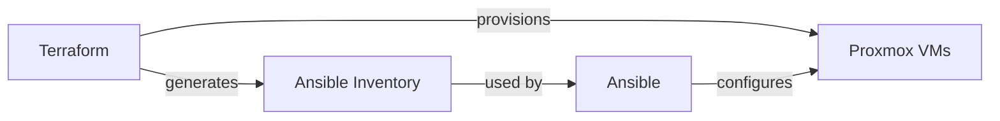
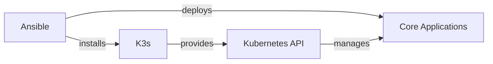

# K3s Home Lab Project Overview

This document provides a comprehensive overview of the K3s Home Lab project, explaining how all components work together to create a production-ready Kubernetes environment on home lab hardware.

## Project Goals

This project aims to:

1. Automate the deployment of a production-quality Kubernetes cluster on home lab hardware
2. Provide a repeatable, infrastructure-as-code approach to cluster management
3. Implement best practices for security, high availability, and monitoring
4. Create a platform for learning and experimenting with Kubernetes technologies

## Architecture Overview

The project follows a typical three-tier architecture:

1. **Infrastructure Layer** (Terraform + Proxmox)

   - Provisions and configures virtual machines
   - Sets up networking and storage
   - Manages SSH key distribution

2. **Platform Layer** (Ansible + K3s)

   - Installs and configures K3s on VMs
   - Sets up high availability for the control plane
   - Configures system requirements (swap, modules, sysctl)

3. **Application Layer** (Kubernetes + Helm)
   - Deploys core services (Traefik, MetalLB)
   - Sets up monitoring stack (Prometheus, Grafana)
   - Configures persistent storage solutions

## Component Integration

### Infrastructure to Platform

Terraform provisions the infrastructure and generates an Ansible inventory:

The key integration points:

1. Terraform creates VMs based on `nodes.yaml` configuration
2. Terraform generates an Ansible inventory file at `ansible/inventory/hosts.ini`
3. Terraform creates SSH keys for secure access

### Platform to Application

Ansible installs K3s and prepares for application deployment:

Key integration points:

1. Ansible roles configure each node according to its purpose (master/worker)
2. Kubernetes applications are deployed using Ansible's Kubernetes modules
3. Kubeconfig is generated for access to the cluster

## Workflow

The typical deployment workflow:

1. **Preparation**

   - Configure VM specifications in `terraform/vars/nodes.yaml`
   - Configure network settings in `terraform/vars/network.yaml`
   - Customize application settings in Ansible variables

2. **Infrastructure Deployment**

   - Run Terraform to provision VMs
   - Verify SSH connectivity to all nodes

3. **Platform Installation**

   - Run Ansible to install K3s on all nodes
   - Verify cluster formation with `kubectl get nodes`

4. **Application Deployment**
   - Run Ansible to deploy core applications
   - Access applications through configured ingress

## Security Considerations

Security is implemented at multiple levels:

1. **Infrastructure Security**

   - SSH key-based authentication
   - Network segmentation for K3s traffic
   - Firewall rules for node access

2. **Platform Security**

   - K3s hardened configuration
   - TLS for all communications
   - Regular OS updates through Ansible

3. **Application Security**
   - Cert-manager for certificate management
   - Network policies for pod communication
   - RBAC for Kubernetes API access

## Disaster Recovery

The project includes multiple disaster recovery mechanisms:

1. **Infrastructure Level**

   - Terraform state backup
   - VM snapshots on Proxmox
   - Version-controlled configuration

2. **Platform Level**

   - Etcd snapshots for K3s state
   - High availability configuration
   - Node rebuild automation

3. **Application Level**
   - PersistentVolume backups
   - Stateful application backups
   - Configuration backups

## Development Workflow

For ongoing development and maintenance:

1. **Infrastructure Changes**

   - Update Terraform configurations
   - Run `terraform plan` to review changes
   - Apply changes with `terraform apply`

2. **Platform Changes**

   - Update Ansible roles and playbooks
   - Test changes with `--check` mode
   - Apply changes with appropriate tags

3. **Application Changes**
   - Update Kubernetes manifests or Helm values
   - Review changes with `kubectl diff`
   - Apply changes with kubectl or Ansible

## Monitoring and Maintenance

The cluster includes comprehensive monitoring:

1. **Infrastructure Monitoring**

   - Node metrics (CPU, memory, disk)
   - Network traffic and latency
   - VM health status

2. **Platform Monitoring**

   - K3s component health
   - etcd metrics and alerts
   - Control plane performance

3. **Application Monitoring**
   - Pod resource usage
   - Service availability
   - Application-specific metrics

## Conclusion

This K3s home lab project provides a complete environment for running Kubernetes in a home setting, with production-quality tooling and practices. The integration between Terraform, Ansible, and Kubernetes creates a seamless workflow for deployment and management, while the modular design allows for customization and extension as needs evolve.

For specific details on each component, refer to the specialized documentation pages:

- [Architecture Design](architecture.md)
- [Terraform Configuration](terraform.md)
- [Ansible Deployment](ansible.md)
- [Application Stack](applications.md)
- [Troubleshooting Guide](troubleshooting.md)
